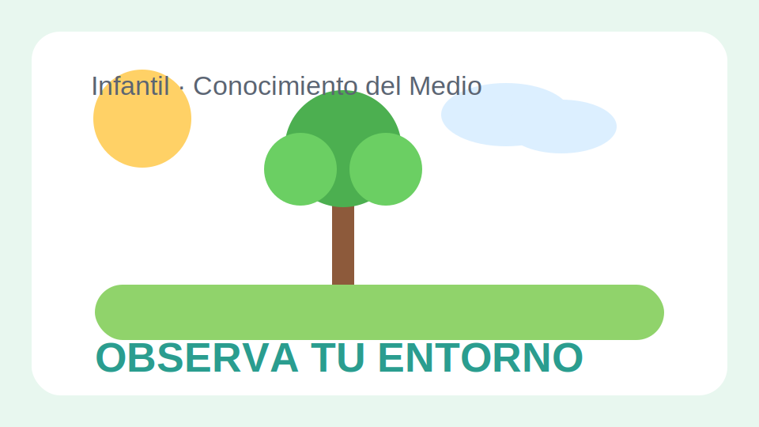

# Conocimiento del Medio Infantil

## Presentacion

Este libro introduce el entorno cercano del alumnado mediante observacion, juego y lenguaje sencillo. Cada bloque propone pequeñas conversaciones, exploraciones guiadas y rutinas faciles de repetir en el aula.

## Objetivos del trimestre

- Nombrar partes del cuerpo y habitos de cuidado.
- Reconocer espacios habituales del colegio y de la casa.
- Diferenciar cambios basicos del tiempo atmosferico.
- Participar en conversaciones cortas sobre lo que se observa.

## Situacion de aprendizaje

El grupo recibe la visita de una mascota de clase que "no conoce" el cole. A lo largo de varias sesiones, el alumnado le explica como son las aulas, el patio, el comedor y las normas basicas para convivir.

### Rutina sugerida

1. Asamblea breve con preguntas de activacion.
2. Observacion de una imagen o de un objeto real.
3. Juego de clasificacion o movimiento.
4. Cierre oral con una frase completa.

<!-- pagebreak -->

## Unidad 1. Asi soy yo

Se trabajan las partes del cuerpo, las emociones basicas y los habitos de higiene con canciones, espejos, tarjetas visuales y actividades de senalar.

### Vocabulario clave

- Cabeza, manos, pies, ojos, boca.
- Contento, triste, enfadado, tranquilo.
- Lavarse, peinarse, descansar, comer.

### Actividades modelo

1. Completar un mural del cuerpo humano con piezas grandes.
2. Jugar a "Simon dice" para mover distintas partes del cuerpo.
3. Preparar una secuencia visual sobre lavarse las manos.
4. Dibujar la cara que representa cada emocion.

## Unidad 2. Los lugares que conozco

Se exploran rincones del aula, patio, biblioteca y comedor para comprender para que sirve cada espacio y como se usa con cuidado.

### Conversaciones guiadas

- Que hacemos en este lugar.
- Que materiales encontramos aqui.
- Como debemos comportarnos.

<!-- pagebreak -->

## Proyecto pequeno

El alumnado prepara un "mapa del cole" con fotos, pictogramas y palabras breves. Cada grupo presenta un espacio y explica una norma importante.

## Evaluacion observable

- Usa vocabulario del entorno en frases cortas.
- Identifica habitos de cuidado personal.
- Participa en juegos de clasificacion y observacion.
- Respeta turnos y escucha al grupo en la asamblea.

## Extension para familias

Se propone repetir en casa la observacion del tiempo y conversar cada dia sobre una estancia del hogar: cocina, salon, bano o dormitorio.
