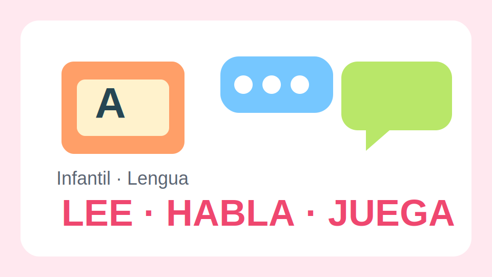

# Lengua Infantil

{: .doc-image .doc-align-center .doc-w-100}

## Presentacion

Este material acompana el desarrollo del lenguaje oral, la escucha y la aproximacion temprana a la lectura a traves de cuentos, rimas y conversaciones significativas.

## Objetivos del bloque

- Ampliar vocabulario de aula, familia y emociones.
- Escuchar cuentos cortos con apoyo visual.
- Repetir estructuras orales sencillas.
- Jugar con sonidos, ritmos y palabras rimadas.
- arreglo

## Ambiente lector

El aula se organiza con una biblioteca visible, tarjetas de palabras frecuentes y rutinas de narracion breve para que el lenguaje aparezca en contextos cotidianos.

### Rutina diaria de cinco minutos

1. Cancion de bienvenida.
2. Palabra del dia con gesto asociado.
3. Lectura dialogada de una pagina o lamina.
4. Repeticion coral de una frase modelo.

<!-- pagebreak -->

## Unidad 1. Escuchar y contar

Se presentan cuentos acumulativos, secuencias de tres escenas y preguntas de comprension muy concretas para favorecer la anticipacion y la expresion oral.

### Propuestas

- Ordenar imagenes del inicio, nudo y final.
- Completar frases guiadas: "Primero...", "Despues...", "Al final...".
- Representar un personaje con marionetas sencillas.

## Unidad 2. Sonidos y juegos de palabras

Las actividades priorizan discriminacion auditiva, palmas silabicas, eco de palabras y rimas faciles.

### Banco de actividades

1. Buscar objetos del aula que empiecen por un sonido.
2. Dar palmas por cada parte de una palabra.
3. Inventar parejas rimadas con apoyo de imagen.
4. Jugar al telefono escacharrado con frases cortas.

<!-- pagebreak -->

## Proyecto oral

El grupo crea un pequeno recital con poesias breves, canciones y una recomendacion oral de su cuento favorito. Cada participante interviene con una frase preparada.

## Indicadores de progreso

- Comprende instrucciones cotidianas.
- Nombra objetos y acciones con seguridad creciente.
- Participa en conversaciones con turnos breves.
- Disfruta de la escucha de cuentos y poemas.

## Propuesta para casa

Enviar una tarjeta semanal con una palabra nueva y una pregunta abierta para conversar en familia durante unos minutos.