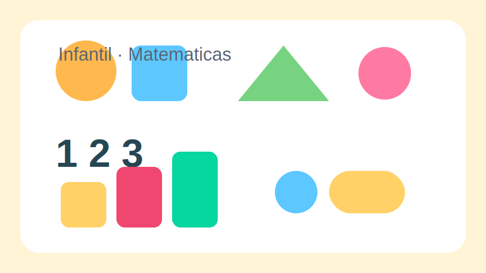
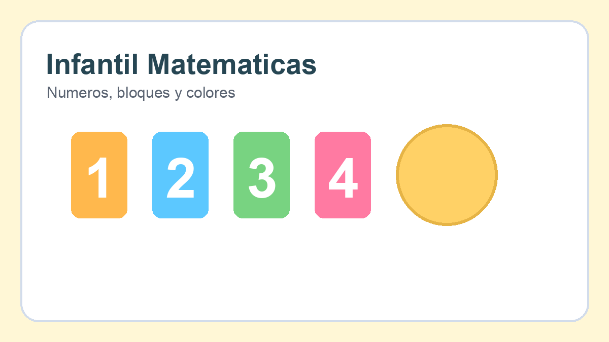

# Matematicas Infantil

## Objetivo

Introducir cantidades, formas y secuencias mediante actividades visuales y manipulativas.

## Contenidos

- Numeros del 1 al 10
- Formas basicas
- Series sencillas
- Comparacion de tamanos

## Actividades

1. Contar objetos del aula.
2. Relacionar numero y cantidad con tarjetas.
3. Identificar circulos, cuadrados y triangulos.
4. Completar series de colores o figuras.

## Evaluacion

- Reconoce numeros basicos.
- Clasifica formas correctamente.
- Sigue secuencias sencillas.

## Notas para el centro

Este libro base se puede adaptar por trimestre, ritmo madurativo o materiales del colegio.
