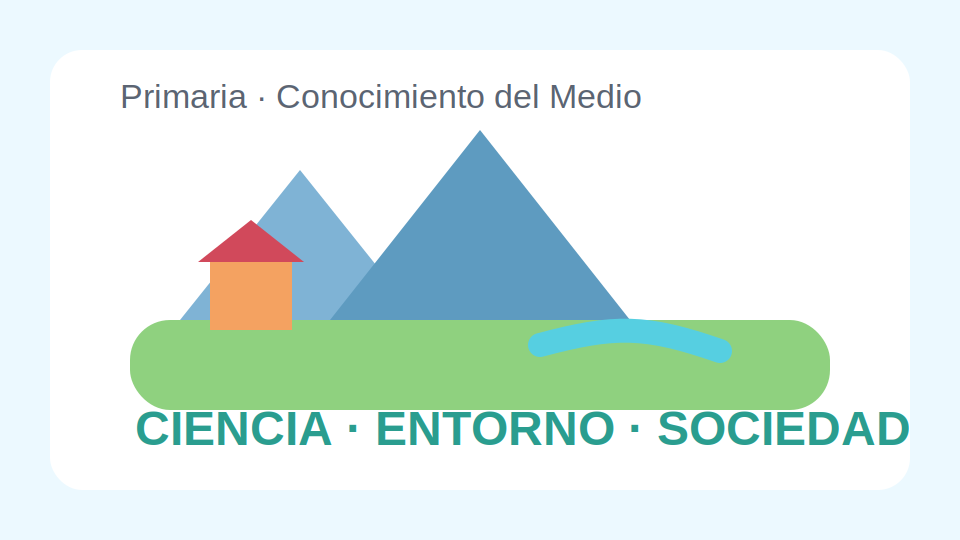

# Conocimiento del Medio Primaria

## Enfoque general

Este libro plantea una mirada integrada sobre naturaleza, sociedad y entorno cercano. Las actividades alternan observacion, lectura de informacion sencilla y pequenos productos cooperativos.

## Objetivos del curso

- Formular preguntas sobre fenomenos del entorno.
- Registrar observaciones con tablas e imagenes.
- Explicar relaciones entre seres vivos, clima y actividades humanas.
- Utilizar vocabulario especifico en exposiciones breves.

## Pregunta guia

Como cambia nuestro entorno a lo largo del ano y de que manera influyen las personas en esos cambios.

<!-- pagebreak -->

## Unidad 1. Observar y registrar

Se introducen el cuaderno de campo, la descripcion de paisajes y la recogida de datos simples sobre temperatura, lluvia y elementos del barrio.

### Tareas propuestas

1. Salida corta para identificar elementos naturales y construidos.
2. Tabla semanal del tiempo atmosferico.
3. Mapa sencillo del recorrido casa-colegio.
4. Ficha de observacion de un arbol del patio.

## Unidad 2. Seres vivos y habitats

El alumnado clasifica animales y plantas por rasgos visibles, necesidades basicas y espacios donde viven.

### Producto intermedio

Cada equipo elabora una lamina con un habitat, tres seres vivos y una explicacion de como se relacionan.

<!-- pagebreak -->

## Unidad 3. Personas, recursos y cuidados

Se estudia el uso responsable del agua, la energia y los espacios comunes. El libro incorpora casos practicos y pequenos debates adecuados al nivel.

### Situaciones para resolver

- Una clase que genera demasiados residuos.
- Un parque del barrio con zonas deterioradas.
- Una casa que quiere ahorrar agua.

## Evaluacion

- Usa tablas y dibujos para registrar informacion.
- Relaciona entorno natural y actividades humanas.
- Participa en debates con ejemplos concretos.
- Propone medidas sencillas de cuidado del medio.

## Cierre del proyecto

Como tarea final, la clase disena una campana de buenos habitos para el colegio con carteles, lemas y una presentacion oral.
