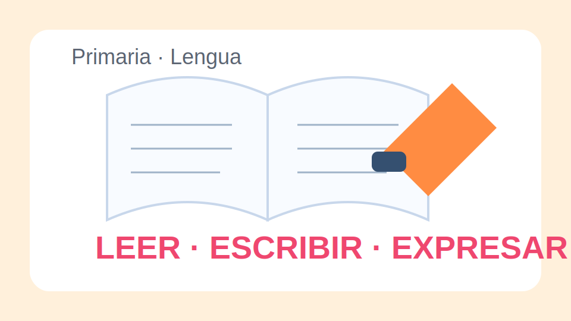
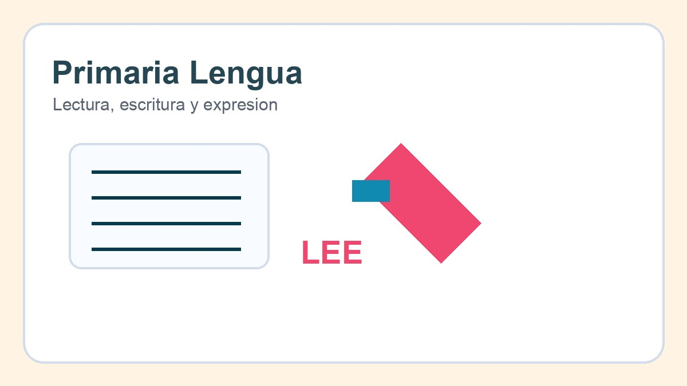

# Lengua Primaria

## Objetivo

Mejorar comprension lectora, expresion escrita y comunicacion oral mediante tareas conectadas con la experiencia del aula y con productos finales claros.

## Saberes trabajados

- Lectura comprensiva de textos narrativos e informativos.
- Planificacion y revision de parrafos breves.
- Ortografia frecuente y puntuacion basica.
- Escucha activa y exposicion oral.

## Situacion de aprendizaje

El grupo prepara una pequena revista escolar. Para ello necesita leer modelos, entrevistar a companeros, redactar noticias sencillas y revisar sus textos antes de publicarlos.

<!-- pagebreak -->

## Unidad 1. Leer para entender

Se trabajan estrategias de anticipacion, localizacion de informacion y explicacion de ideas principales a partir de textos breves y preguntas guiadas.

[[columns:2]]
### Lectura guiada

El docente lee en voz alta y el grupo identifica personajes, lugares y acciones clave con ayuda de un codigo de color compartido.
[[col]]
### Practica autonoma

El alumnado completa una ficha breve de comprension y revisa sus respuestas en pareja.

[[worksheet:ficha-comprension-revista|Abrir ficha de comprension]]
[[/columns]]

### Actividades

1. Subrayar personajes, lugares y acciones clave.
2. Completar un esquema de inicio, nudo y desenlace.
3. Identificar la idea principal de un texto informativo.
4. Justificar una respuesta con una cita breve del texto.

## Unidad 2. Escribir con estructura

El alumnado planifica notas, descripciones y pequenas noticias usando organizadores visuales y listas de revision.

### Taller de escritura

- Esquema de quien, que, cuando y donde.
- Borrador con dos parrafos.
- Revision por parejas.
- Edicion final para la revista de aula.

<!-- pagebreak -->

## Unidad 3. Hablar y escuchar

Las sesiones incluyen entrevistas, lecturas en voz alta, recomendaciones de libros y pequenas exposiciones con apoyo visual.

### Proyecto final

Cada equipo publica una doble pagina de la revista con una noticia, una recomendacion lectora y una ilustracion comentada.

## Evaluacion

- Comprende ideas principales y detalles relevantes.
- Escribe textos breves con orden y cohesion.
- Aplica convenciones ortograficas frecuentes.
- Interviene oralmente con claridad y escucha activa.

## Ampliacion

Se proponen rincones de lectura, diarios breves y podcasts de aula para extender el trabajo durante el trimestre.
