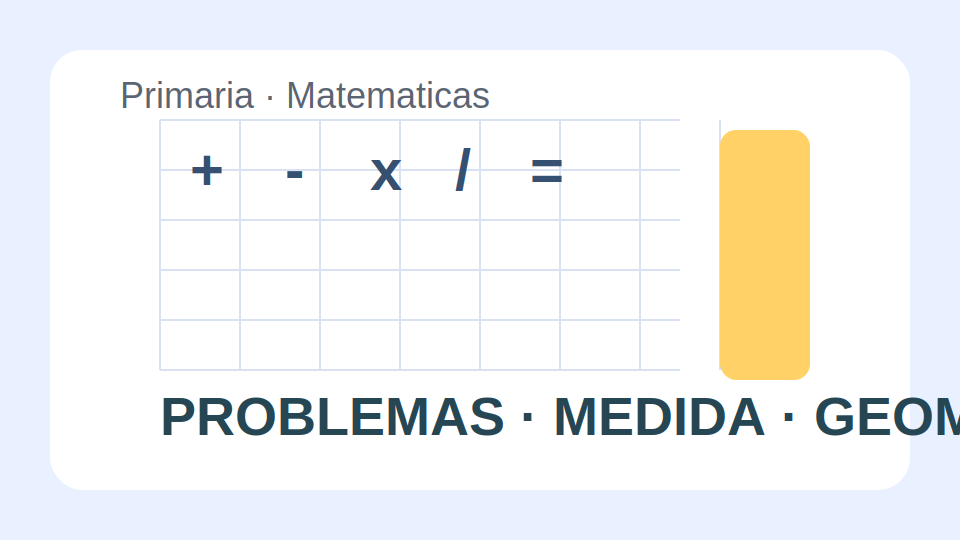

# Matematicas Primaria

## Objetivo

Consolidar calculo, resolucion de problemas y razonamiento matematico en situaciones cercanas, combinando trabajo manipulativo, representacion grafica y explicacion oral de procedimientos.

## Ejes del libro

- Numeracion y valor posicional.
- Operaciones y estrategias de calculo.
- Resolucion de problemas de una y dos etapas.
- Medidas, datos y geometria.

## Contexto motivador

El curso organiza una feria solidaria. A lo largo de las unidades se usan ejemplos de compras, recuentos, horarios, planos y registros de datos relacionados con esa feria.

<!-- pagebreak -->

## Unidad 1. Numeros y operaciones

Se repasan descomposiciones, redondeo y operaciones basicas con materiales base diez, rejillas y lineas numericas.

### Propuestas de aula

1. Construir numeros con bloques y escribir varias descomposiciones.
2. Explicar dos caminos distintos para resolver una suma.
3. Resolver restas con apoyo visual y comprobacion.
4. Comparar resultados estimados y exactos.

## Unidad 2. Problemas cotidianos

Los problemas se presentan con datos relevantes e irrelevantes para obligar a seleccionar informacion y justificar el procedimiento seguido.

### Estrategias

- Representar con dibujo o esquema.
- Elegir la operacion necesaria.
- Revisar si el resultado tiene sentido.

<!-- pagebreak -->

## Unidad 3. Medida, datos y espacio

La ultima parte integra magnitudes, graficos sencillos y figuras geometricas a partir de situaciones del colegio y del barrio.

### Producto final

Cada equipo diseña un puesto de la feria con presupuesto, cartel de precios, plano del espacio y registro de ventas simuladas.

## Evaluacion

- Resuelve operaciones con autonomia creciente.
- Elige estrategias adecuadas para problemas.
- Usa unidades de medida habituales.
- Interpreta tablas y graficos sencillos.
