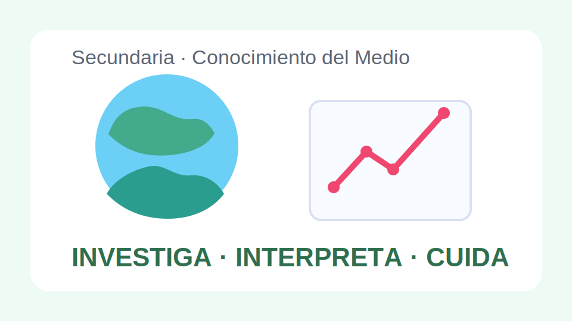
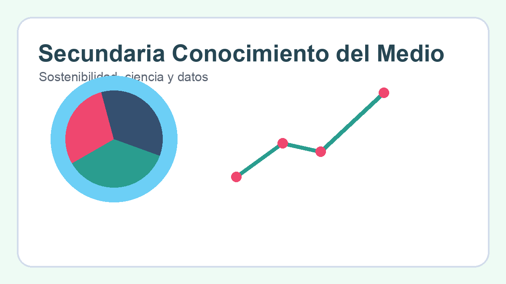

# Conocimiento del Medio Secundaria

## Objetivo

Relacionar ciencia, sociedad y territorio con una aproximacion interdisciplinar.

## Contenidos

- Metodo cientifico
- Ecosistemas y sostenibilidad
- Poblacion y territorio
- Tecnologia y sociedad

## Unidades

### Unidad 1. Investigar el entorno

Observacion, hipotesis, recogida de datos y conclusiones.

### Unidad 2. Sostenibilidad

Impacto ambiental, consumo responsable y conservacion.

### Unidad 3. Sociedad y territorio

Cambios demograficos, urbanizacion y desigualdad territorial.

## Actividades

1. Mini proyecto de investigacion.
2. Analisis de un problema ambiental local.
3. Lectura de mapas y graficas de poblacion.
4. Debate sobre tecnologia y bienestar.

## Evaluacion

- Formula preguntas e interpreta datos.
- Explica relaciones entre ciencia, medio y sociedad.
- Presenta conclusiones con claridad.
