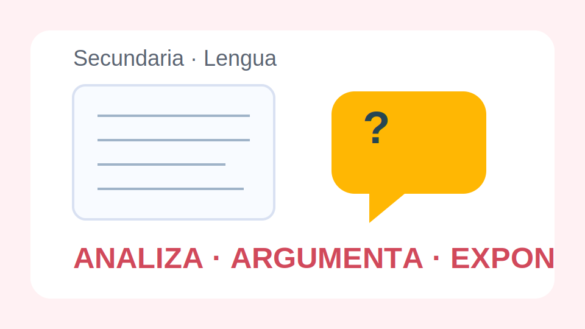

# Lengua Secundaria

## Proposito

Desarrollar lectura critica, escritura argumentativa y comunicacion oral formal a traves de proyectos conectados con temas sociales y culturales relevantes para el alumnado.

## Hilos del curso

- Analisis de textos literarios y periodisticos.
- Escritura de resenas, columnas y textos de opinion.
- Revision consciente de cohesion, registro y puntuacion.
- Debate, entrevista y exposicion oral.

## Proyecto vertebrador

La clase prepara un dossier digital de recomendaciones culturales para estudiantes del centro. Cada unidad aporta piezas para ese dossier.

<!-- pagebreak -->

## Unidad 1. Leer con mirada critica

Se comparan noticias, articulos y fragmentos literarios para identificar punto de vista, tema, tono y estrategias discursivas.

### Practicas

1. Diferenciar hecho, opinion e inferencia.
2. Localizar tesis y argumentos.
3. Analizar el efecto de un titular.
4. Relacionar un fragmento literario con su contexto.

## Unidad 2. Escribir para convencer

El trabajo de escritura incorpora planificacion, borradores, contraargumentos y revision de estilo.

### Secuencia de produccion

- Elegir un tema cercano.
- Formular una tesis clara.
- Organizar argumentos y ejemplos.
- Revisar conectores, puntuacion y cierre.

<!-- pagebreak -->

## Unidad 3. Hablar en publico

Las actividades finales se centran en debate academico, presentacion oral y entrevista, con atencion a estructura, tono y apoyos visuales.

### Producto final

Cada estudiante entrega una resena cultural y participa en una mesa redonda breve defendiendo su recomendacion.

## Criterios de evaluacion

- Interpreta textos con mirada critica.
- Escribe argumentos claros y cohesionados.
- Adapta el registro a cada tarea.
- Interviene oralmente con orden y pertinencia.
