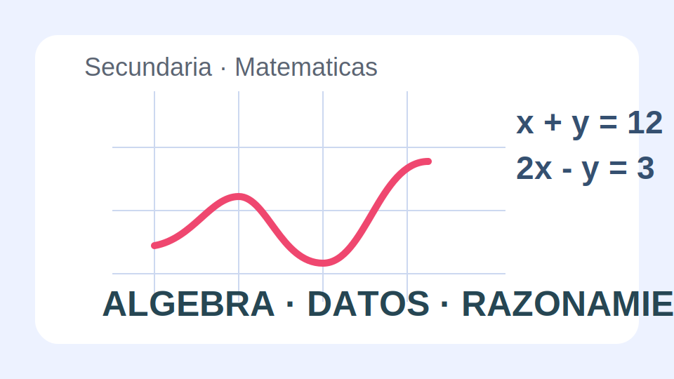

# Matematicas Secundaria

## Proposito

Reforzar pensamiento algebraico, modelizacion y analisis de datos mediante situaciones que exijan justificar procedimientos, comparar estrategias y comunicar resultados con precision.

## Estructura del libro

- Numeros, proporcionalidad y sentido del error.
- Algebra y funciones.
- Geometria y medida.
- Estadistica aplicada a problemas reales.

## Contexto de trabajo

El curso estudia la viabilidad de varias propuestas para mejorar espacios del centro: redistribucion del patio, horarios y consumo energetico.

<!-- pagebreak -->

## Unidad 1. Razonamiento numerico y proporcional

Se abordan porcentajes, escalas, tasas y estimaciones con ejemplos relacionados con presupuestos, encuestas y comparacion de opciones.

### Actividades destacadas

1. Analizar descuentos y coste final.
2. Comparar dos planes de pago.
3. Estimar consumos y justificar el margen de error.
4. Resolver problemas de mezcla y reparto proporcional.

## Unidad 2. Algebra y representacion

El alumnado modeliza relaciones entre variables, interpreta graficas y utiliza expresiones algebraicas para describir patrones.

### Preguntas clave

- Que representa cada variable.
- Como cambia una magnitud respecto a otra.
- Que informacion aporta el corte con los ejes.

<!-- pagebreak -->

## Unidad 3. Geometria, datos y decisiones

Las tareas finales conectan planos, areas, volumenes y analisis de datos para apoyar decisiones razonadas sobre mejoras del centro.

### Producto final

Cada equipo presenta una propuesta cuantificada con plano, presupuesto aproximado y defensa de por que su opcion es la mas adecuada.

## Evaluacion

- Resuelve problemas con estrategias justificadas.
- Traduce situaciones a expresiones y graficas.
- Usa herramientas geometricas y estadisticas con sentido.
- Comunica resultados con precision matematica.
